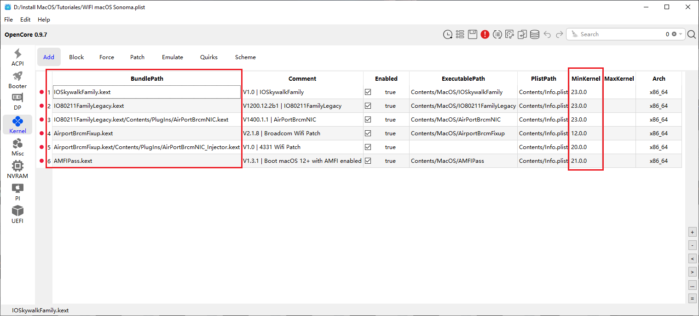
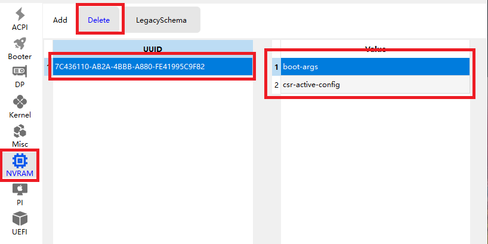
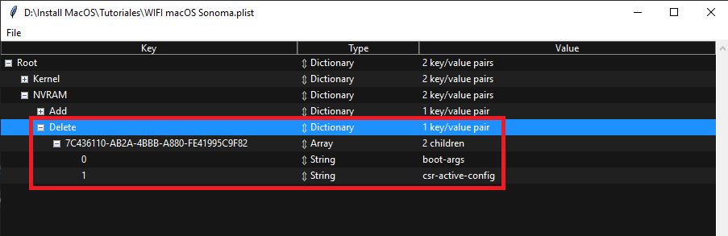

# Soporte para Broadcom WiFi y Bluetooth macOS 14 Sonoma 
- Bienvenido al repositorio oficial de ReinierTutoriales para Soporte de tarjetas Broadcom en macOS
- Todo el credito del soporte es gracias a la [👉OpenCore Legacy Patcher](https://github.com/dortania/OpenCore-Legacy-Patcher/)

## Dónde Comprar
- [x] Tarjeta PCI Wifi para MacOS: `FENVI T919` [👉💰Compr Aquí💰](https://amzn.to/3OOEQoa)

## Video de Ayuda👇
[](https://www.youtube.com/watch?v=ZIEt9QYUu0Y)

## Necesitan inyectar los siguientes kexts
- [x] `IOSkywalk.kext`  [👉Descargar ](https://github.com/dortania/OpenCore-Legacy-Patcher/blob/main/payloads/Kexts/Wifi/IOSkywalkFamily-v1.1.0.zip)
- [x] `IO80211FamilyLegacy.kext`  [👉Descargar ](https://github.com/dortania/OpenCore-Legacy-Patcher/blob/main/payloads/Kexts/Wifi/IO80211FamilyLegacy-v1.0.0.zip)
  * Este Kext tiene un `Complemento` , `AirPortBrcmNIC.kext`asegúrese de que también se inyecte en su `config.plist`
- [x] `AirportBrcmFixup` [👉Descargar ](https://github.com/acidanthera/AirportBrcmFixup/releases)
  * Este Kext tiene un `Complemento` , `AirPortBrcmNIC_Injector.kext`asegúrese de que también se inyecte en su  `config.plist`
- [x] `AMFIPass` [👉Descargar ](https://github.com/dortania/OpenCore-Legacy-Patcher/blob/main/payloads/Kexts/Acidanthera/AMFIPass-v1.4.0-RELEASE.zip)

- [x] Organice los kexts como se muestra a continuación y agregue MinKernel a su config.plist

  


## Bloquear IOSkywalkFamily 
- [x] `com.apple.iokit.IOSkywalkFamily`  [Referencia](https://github.com/dortania/OpenCore-Legacy-Patcher/blob/e21efa975c0cf228cb36e81a974bc6b4c27c7807/payloads/Config/config.plist#L1695-L1710/)
- [x] Para eso diríjase a `Kernel | Block` y agrege el siguiente parche.
```md
<?xml version="1.0" encoding="UTF-8"?>
<!DOCTYPE plist PUBLIC "-//Apple//DTD PLIST 1.0//EN" "http://www.apple.com/DTDs/PropertyList-1.0.dtd">
<plist version="1.0">
<array>
	<dict>
		<key>Arch</key>
		<string>Any</string>
		<key>Comment</key>
		<string>Allow IOSkywalk Downgrade</string>
		<key>Enabled</key>
		<false/>
		<key>Identifier</key>
		<string>com.apple.iokit.IOSkywalkFamily</string>
		<key>MaxKernel</key>
		<string></string>
		<key>MinKernel</key>
		<string>23.0.0</string>
		<key>Strategy</key>
		<string>Exclude</string>
	</dict>
</array>
</plist>

```
## Configurar Secure Boot Model
- [x]  `Secure Boot Model` selecciónalo en `Disabled`.

## La protección de integridad del sistema está establecida en 0x803
- [x] Para eso diríjase a `NVRAM | Add | 7C436110-AB2A-4BBB-A880-FE41995C9F82`
  * Edite su `csr-active-config`
  * Cambie `00000000` por `03080000`
- [x] Agragar en su boot-args Opcionales
  * Para activar  `AMFIPass.kext`  en macOS 14 Sonoma  `-amfipassbeta`  
  * En caso de que no se pueden aplicar parches raíz  `amfi=0x80`
  * Resuelve el bloqueo de electrones con SIP abierto a partir de macOS 12.3 `ipc_control_port_options=0`
- [x] Restablezca NVRAM o asegurarse de tener agregadas las siguientes variable en `NVRAM | Delete | 7C436110-AB2A-4BBB-A880-FE41995C9F82`.
  * Valor `1`  Tipo  `String`  valuado  `boot-args`
  * Valor `2`  Tipo  `String`  valuado  `csr-active-config`

  

  


## Para finalizar Finalmente
- [x] Necesitan reiniciar el sistema.
- [x] Despues de este reinicio  necesitan ejecutar `OpenCore Legacy Patcher` [👉 Repositorio ](https://github.com/dortania/OpenCore-Legacy-Patcher/releases)


> [!IMPORTANT]
> Todo esto es gracias a los proyectos que han desarrollado la solución como son [Dortania y Opencore Legacy Patcher](https://dortania.github.io/OpenCore-Legacy-Patcher/INSTALLER.html) .
> Estos proyectos permiten tener compatibilidad con Wireless Broadcom WiFi y Bluetooth en macOS 14 Sonoma .
